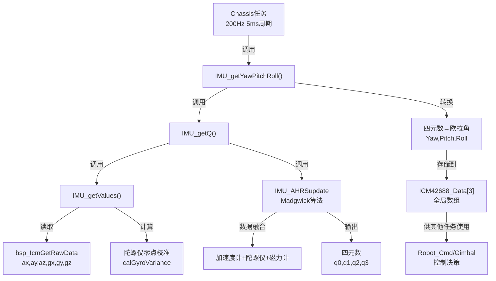

## 📊 IMU姿态解算完整流程


BMI088 模块引脚	功能描述	MSPM0 单片机引脚	芯片物理脚编号 (Package Pin)	代码中对应的 SysConfig 宏定义
VCC / VDD	电源正极	3.3V	-	-
GND	电源地	GND	-	-
CSB1 / ACC_CS	加速度计片选	GPIOA.29	Pin 36	ICM42688_CS_CS_PIN
CSB2 / GYR_CS	陀螺仪片选	GPIOA.16	Pin 9	bmi088_cs2_cs2_PIN
SCL / SCLK	SPI 时钟线	GPIOA.11	PinCM22	GPIO_ICM42688_SCLK_PIN
SDA / MOSI	SPI 主出从入	GPIOB.17	PinCM43	GPIO_ICM42688_PICO_PIN
SDO / MISO	SPI 主入从出	GPIOA.10	PinCM21	GPIO_ICM42688_POCI_PIN
PS (若有)	协议选择	接 GND	-	保持低电平以固定为 SPI 模式

### 1️⃣ **函数调用链与频率**

```
Chassis任务运行 (每5ms调用一次 = 200Hz)
    ↓
IMU_getYawPitchRoll(ICM42688_Data)
    ↓
IMU_getQ(q)  ← 获取四元数
    ├─ IMU_getValues()  ← 读取传感器原始数据
    └─ IMU_AHRSupdate() ← AHRS解算（最核心）
        ↓
四元数(q0,q1,q2,q3)转换为欧拉角
    ↓
返回 [Yaw, Pitch, Roll]
```

**调用频率**：
- **Chassis函数**：200Hz（5ms周期）→ `vTaskDelay(pdMS_TO_TICKS(5))`
- **RobotCmd函数**：200Hz（5ms周期）→ `vTaskDelay(pdMS_TO_TICKS(5))`
- **IMU_getYawPitchRoll()**：**200Hz**（在Chassis中被调用）

---

### 2️⃣ **核心函数详解**

#### **阶段1：`IMU_getValues()` - 读取原始数据**

```c
void IMU_getValues(float * values) {  
    icm42688RealData_t accval;      // 加速度
    icm42688RealData_t gyroval;     // 角速度
    
    // 1. 从ICM42688硬件读取原始数据（通过SPI/I2C）
    bsp_IcmGetRawData(&accval, &gyroval);
    
    // 2. 计算陀螺仪偏移（零点漂移校准）
    calGyroVariance(...);  // 滑动窗口（300个点）计算方差
    
    // 3. 陀螺仪数据去偏
    values[0-2] = 加速度 (ax, ay, az)
    values[3-5] = 陀螺仪 - 偏移量 (gx, gy, gz)
    values[6-8] = 磁力计 (mx, my, mz) [未使用]
}

// 陀螺仪零点校准细节
if (方差 < 0.02) {  // 当陀螺仪很稳定时
    gyro_offset[0-2] = 平均值
    exInt = eyInt = ezInt = 0  // 重置积分项
}
```

#### **阶段2：`IMU_AHRSupdate()` - AHRS姿态解算（★最复杂）**

**使用Madgwick算法**（融合加速度+陀螺仪+磁力计）：

```c
void IMU_AHRSupdate(float gx, gy, gz, float ax, ay, az, float mx, my, mz) {
    
    // === 第一步：数据单位化 ===
    float norm = invSqrt1(ax² + ay² + az²);
    ax = ax * norm;  // 加速度向量单位化
    // ... ay, az 同样处理
    
    // === 第二步：计算重力加速度向量 ===
    // 将当前四元数的姿态逆向转换到加速度计参考系
    vx = 2*(q1*q3 - q0*q2);           // 重力矢量X分量
    vy = 2*(q0*q1 + q2*q3);           // 重力矢量Y分量
    vz = q0² - q1² - q2² + q3²;       // 重力矢量Z分量
    
    // === 第三步：计算误差 ===
    // 通过向量叉积计算加速度计测量值与预测值的偏差
    ex = (ay*vz - az*vy);  // 绕X轴误差
    ey = (az*vx - ax*vz);  // 绕Y轴误差
    ez = (ax*vy - ay*vx);  // 绕Z轴误差
    
    // === 第四步：PI控制器更新陀螺仪偏差 ===
    if(ex != 0 && ey != 0 && ez != 0) {
        // 积分项累积（纠正长期漂移）
        exInt += ex * Ki * halfT;  // Ki = 0.001
        eyInt += ey * Ki * halfT;
        ezInt += ez * Ki * halfT;
        
        // 陀螺仪数据+比例项+积分项（补偿）
        gx = gx + Kp*ex + exInt;   // Kp = 0.5
        gy = gy + Kp*ey + eyInt;
        gz = gz + Kp*ez + ezInt;
    }
    
    // === 第五步：四元数微分方程 ===
    halfT = (now - lastUpdate) / 2000000.0  // 半时间间隔(微秒转秒)
    
    q0 = q0 + (-q1*gx - q2*gy - q3*gz)*halfT;
    q1 = q1 + (q0*gx + q2*gz - q3*gy)*halfT;
    q2 = q2 + (q0*gy - q1*gz + q3*gx)*halfT;
    q3 = q3 + (q0*gz + q1*gy - q2*gx)*halfT;
    
    // === 第六步：四元数归一化 ===
    norm = invSqrt1(q0² + q1² + q2² + q3²);
    q0 = q0 * norm;  // 保证 q0²+q1²+q2²+q3² = 1
    // ... q1, q2, q3 同样处理
}
```

**参数说明**：
- **Kp = 0.5**：比例增益，控制对加速度计的响应快速性
- **Ki = 0.001**：积分增益，纠正长期陀螺仪漂移
- **halfT**：两次调用间的时间间隔（单位：秒）

#### **阶段3：`IMU_getYawPitchRoll()` - 四元数转欧拉角**

```c
void IMU_getYawPitchRoll(float * angles) {
    float q[4];
    IMU_getQ(q);  // 获取最新四元数
    
    // 四元数→欧拉角（航向角、俯仰角、横滚角）
    // 使用atan2和asin进行反三角函数计算
    
    angles[0] = atan2(2*(q[0]*q[3] + q[1]*q[2]), 
                      1 - 2*(q[2]² + q[3]²)) * RAD_TO_DEG;  // Yaw偏航角
    
    angles[1] = -asin(-2*(q[1]*q[3] - q[0]*q[2])) * RAD_TO_DEG;  // Pitch俯仰角
    
    angles[2] = atan2(2*(q[0]*q[1] + q[2]*q[3]), 
                      1 - 2*(q[1]² + q[2]²)) * RAD_TO_DEG;  // Roll横滚角
}
```

---

### 3️⃣ **数据传输路径**

```
硬件层：
┌─────────────────────────┐
│  ICM42688传感器         │ ← 6轴IMU (加速度 + 陀螺仪)
│  输出：ax,ay,az,gx,gy,gz│
└──────────────┬──────────┘
               │ (SPI/I2C)
               ↓
┌─────────────────────────┐
│  bsp_IcmGetRawData()    │ ← BSP驱动层
│  返回原始ADC值           │
└──────────────┬──────────┘
               │
               ↓
应用层：
┌─────────────────────────┐
│  Chassis任务 (200Hz)    │
│  ↓ 每5ms调用一次        │
│  IMU_getYawPitchRoll()  │
│  ↓                      │
│  IMU_getValues()        │ ← 数据预处理+零点校准
│  ↓                      │
│  IMU_AHRSupdate()       │ ← Madgwick算法
│  ↓                      │
│  输出：q0,q1,q2,q3      │ ← 四元数
│  ↓                      │
│  转换为Yaw,Pitch,Roll   │
│  ↓                      │
│  ICM42688_Data[3]       │ ← 全局缓冲区（未加锁）
└─────────────────────────┘
```

---

### 4️⃣ **关键参数汇总**

| 参数                   | 值    | 单位 | 说明                       |
| ---------------------- | ----- | ---- | -------------------------- |
| **采样频率**           | 200   | Hz   | Chassis任务周期            |
| **时间间隔(halfT)**    | 2.5-5 | ms   | 两次AHRS更新间隔           |
| **Kp**                 | 0.5   | -    | 比例增益（加速度权重）     |
| **Ki**                 | 0.001 | -    | 积分增益（陀螺仪漂移校准） |
| **陀螺仪零点方差阈值** | 0.02  | -    | 判断静止的条件             |
| **零点校准窗口**       | 300   | 点   | 滑动窗口大小               |

---

### 5️⃣ **快速反平方根优化**

```c
float invSqrt1(float x) {
    // Quake III引擎的著名优化算法
    // 计算 1/√x（不是直接调用sqrt）
    
    float halfx = 0.5f * x;
    float y = x;
    long i = *(long*)&y;              // 位强制转换
    i = 0x5f3759df - (i>>1);          // 魔数+右移（牛顿迭代初值）
    y = *(float*)&i;                  // 转换回浮点
    y = y * (1.5f - (halfx * y * y)); // Newton-Raphson迭代
    return y;
}
```

这个算法比 `1.0f / sqrtf(x)` 快约4倍！

---

### 6️⃣ **总结流程图**



---

### 💡 **现状评估**

✅ **优点**：
- 200Hz更新频率足以支持实时控制
- Madgwick算法融合多传感器，抗干扰能力强
- 动态零点校准，减少陀螺仪漂移

⚠️ **注意**：
- `ICM42688_Data[3]` 是全局变量，**无加锁保护**
- 多任务访问可能读到不一致数据
- 建议添加互斥锁保护（如前面讨论的方案3）
