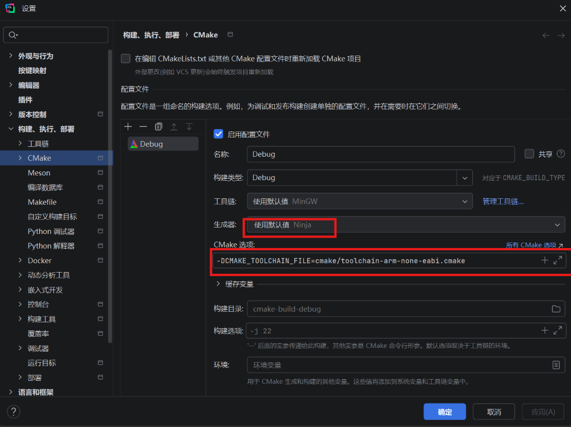
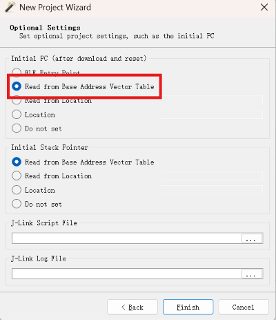
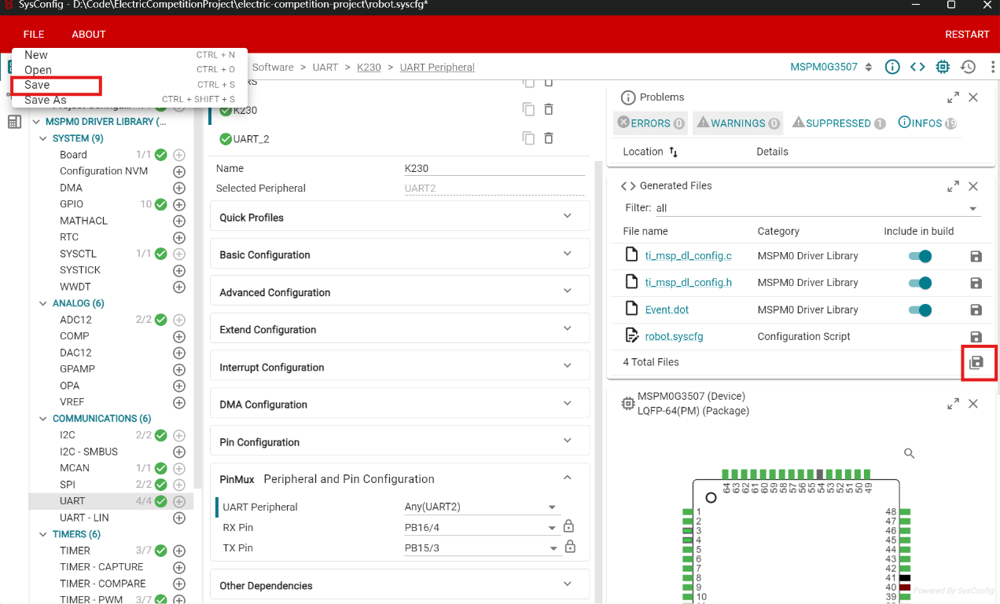
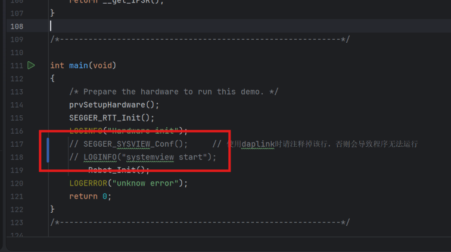
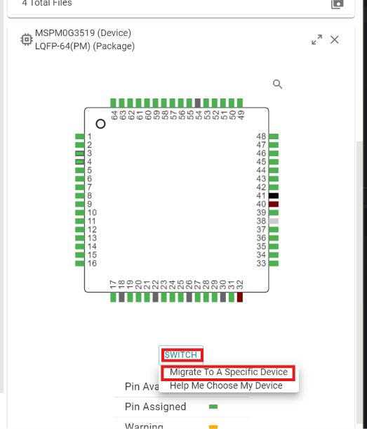
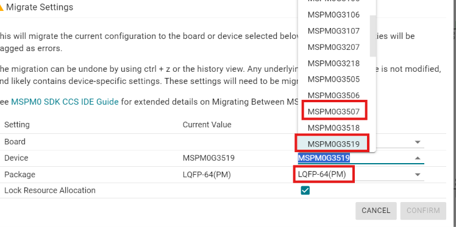
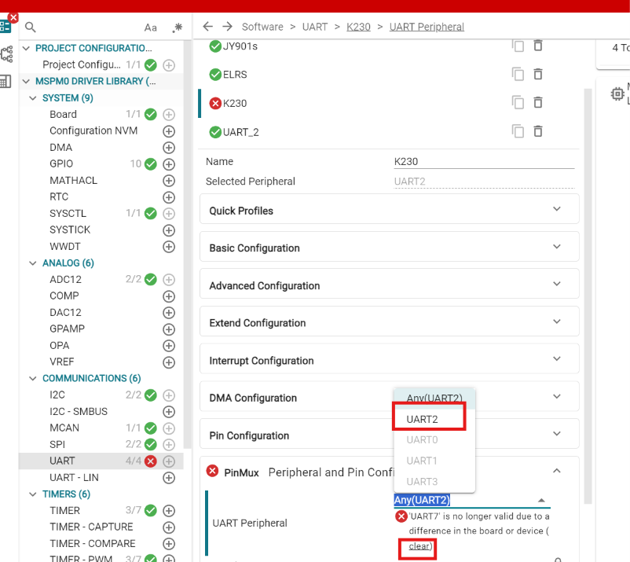
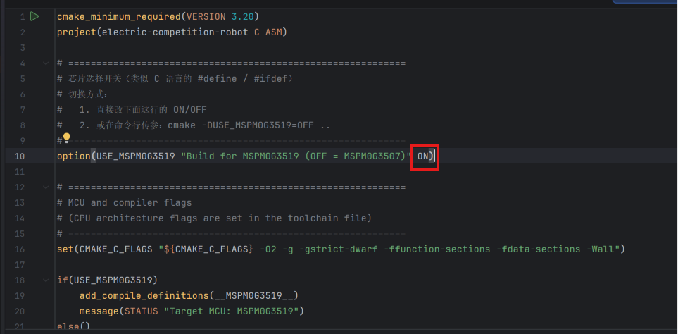

## 项目概述

基于嘉立创天猛星MSPM0G3507开发板的电赛框架，支持差分驱动底盘+二轴云台，搭载视觉跟踪，采用模块化架构设计，支持跨平台开发

基于TI SDK例程建立，例程位置在：mspm0_sdk_2_10_00_04\examples\rtos\LP_MSPM0G3507\kernel\blink_led

## 开发环境

支持的IDE
CLion + CMake
Keil MDK

## 硬件平台
MCU: TI MSPM0G3507 (ARM Cortex-M0+, 80MHz, 128KB Flash, 32KB SRAM)
开发板: 嘉立创天猛星MSPM0G3507
调试器: J-Link / DAPLink (4MHz SWD)

新增支持 TI MSPM0G3519，天猛星升级方法见：
```【全网首发】天猛星隐藏升级方案！手把手教你3507直接替换3519】https://www.bilibili.com/video/BV1SHN466EyH?vd_source=0ec807ca37217dda15dcd3c1863ba0c9 ```

## 项目架构

```
electric-competition-training/
├── 📁 Core/           # 系统核心（入口 & 初始化）
│   ├── main.c        # 程序入口
│   └── app_tasks.c   # FreeRTOS任务创建
├── 📁 APP/           # 应用层逻辑
│   ├── Robot.c       # 系统初始化入口
│   ├── Chassis.c     # 底盘控制
│   ├── Gimbal.c      # 云台控制
│   └── Robot_Cmd.c  # 命令队列管理
├── 📁 BSP/           # 硬件驱动层
│   ├── Motor/        # 电机驱动（DC/步进）
│   ├── Sensor/       # 传感器（IMU/巡线）
│   ├── Display/      # 屏幕显示，菜单功能选择
│   ├── IMU/          # SPI通信的ICM陀螺仪和串口通信的JY901s陀螺仪
│   ├── Comm/         # 通信（K230/无线）
│   ├── System/       # 系统工具（PID/守护进程等）
│   ├── Trace/        # 循迹功能
│   └── Motor_DJIDM/  # 懂得都懂
└── 📁 Vendor/        # 第三方库
    ├── FreeRTOS      # 实时操作系统
    ├── mspm0_sdk     # TI官方SDK
    └── SEGGER        # 调试工具链
```

## 快速开始

### 环境准备

参考[天猛星入门手册 | 立创开发板技术文档中心](https://wiki.lckfb.com/zh-hans/tmx-mspm0g3507/keil-beginner/)

### CLion开发

使用CLion打开项目

 ==配置CMake选项：-DCMAKE_TOOLCHAIN_FILE=cmake/toolchain-arm-none-eabi.cmake（确保指向正确的cmake/toolchain-arm-none-eabi.cmake）==



编译并 使用jlink+ozone烧录，记得勾选：



### Keil开发

项目路径为：Vendor/target/keil/

编译产物在Vendor/target/keil/Objects/

### 引脚配置

使用TI SysConfig直接打开 robot.syscfg文件进行引脚配置

配置完成后File-Save以及右边的保存，可重新生成驱动代码，ti_msp_dl_config.c和.h会更新




### Daplink无线调试

用keil打开项目工程，勾选Daplink即可

记得注释SYSVIEW相关内容，否则daplink运行程序的时候会停在SYSVIEW初始化代码的某个位置



### 双芯片更换方式：
CmakeLists中更改开头的option定义即可，同时记得打开robot.syscfg文件，修改MCU型号为MSPM0G3519，冲突的UART2换成UART7即可（引脚相同，只是3519没有UART2这个外设，懒得话也可以直接改代码。。。）然后左上角file-save，右侧再保存，即可重新生成驱动代码







这里记得一定要勾选LQFP-64(PM)

这里冲突的直接勾选UART2或者下面提示的<u>clear</u>



CmakeLists里面修改如下（见注释，选择合适的芯片型号）：

